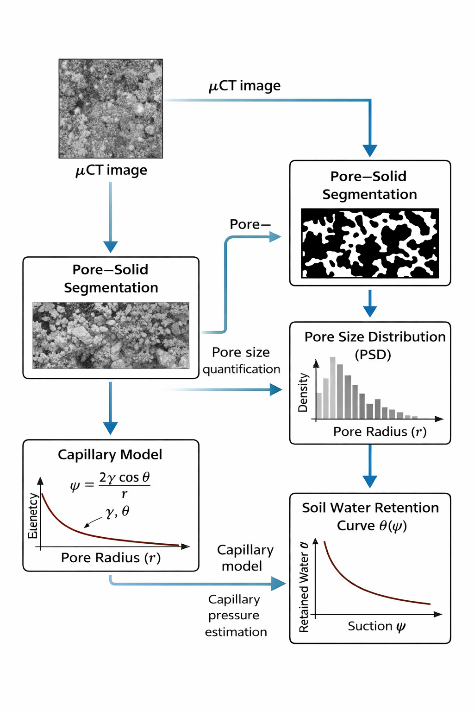
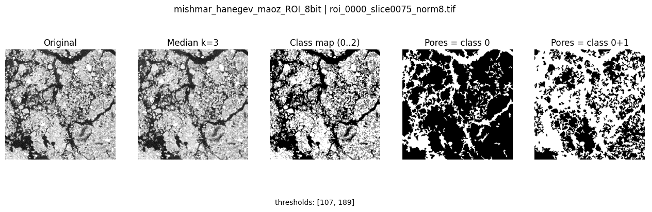
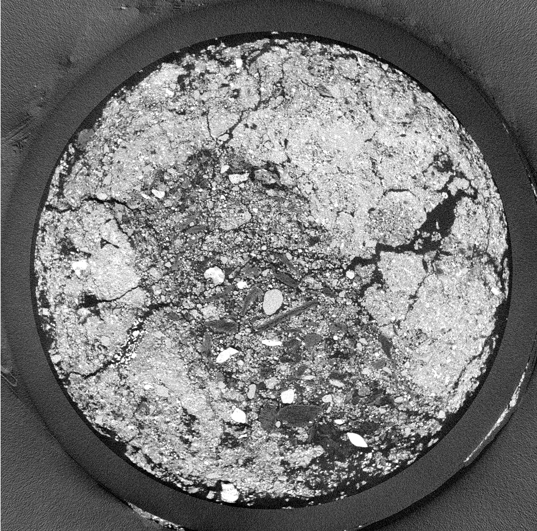

# Soil μCT Pore–Solid Segmentation

This repository contains code and notebooks for automatic pore–solid segmentation
of soil μCT images using classical image processing methods.

  

## Project overview
- Dataset: grayscale soil μCT images (≈8,000 slices)
- Location: Mishmar HaNegev, Rehovot, Bnei Reem
- Task: pore–solid segmentation
- Methods:
  - Preprocessing (normalization, bit-depth conversion, filtering)
  - Otsu thresholding
    

  

## Data availability
The μCT dataset is unpublished and cannot be shared publicly.
The repository contains only example outputs and scripts.

Example slice μCT image slice from the soil dataset acquired at Mishmar HaNegev (pixel size: 5.8 μm)

  

## Scripts

- [`otsu_segmentation.ipynb`](otsu_segmentation.ipynb)  
  Single-threshold Otsu segmentation for pore–solid separation.

- [`multiotsu_segmentation.ipynb`](multiotsu_segmentation.ipynb)  
  Multi-level Otsu segmentation for improved phase separation.

- [`preprocess_ct_images.py`](preprocess_ct_images.py)  
  Preprocessing of raw µCT images (normalization, filtering).
